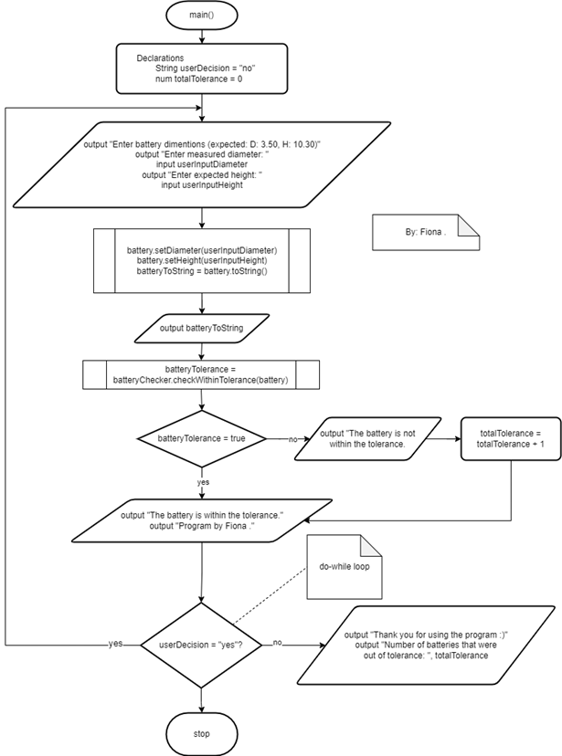

# 🔋 Precision-Battery-QA-Tool
*A Java program that validates battery dimensions against manufacturing tolerances*


## Code Highlights 💻
- Precision floating-point comparisons (epsilon tolerance)
- Robust input validation (handles non-numeric entries gracefully)
- Clean OOP separation (model, validator, and I/O in distinct classes)
- Audit-ready reporting (tracks out-of-tolerance counts)

## 🎯 Features
- Measures battery diameter and height against expected specifications
- Customizable tolerance thresholds (ε-diameter and ε-height)
- Interactive console interface with input validation
- Detailed tolerance violation tracking
- Clean OOP implementation with proper encapsulation

## UML Class Diagrams
<p align="center">
  
</p>

## Flowcharts
<p align="center">
  
</p>
<p align="center">main method flowchart</p>
<p align="center"> ⋆ . ˚  ᡣ 𐭩  . 𖥔 ˚</p>
<p align="center">
  
</p>
<p align="center">checkWithinTolerance method flowchart</p>

## How It Work ⚙️
1. User enter measured dimensions when prompted
3. View immediate validation results
4. Continue checking batteries or exit

## Example Usage 📝
```
Enter battery dimensions (expected: D: 3.50mm, H: 10.30mm)
Battery: diameter 3.45, height 10.35
The battery is within tolerance.
Program by Fiona.
```
